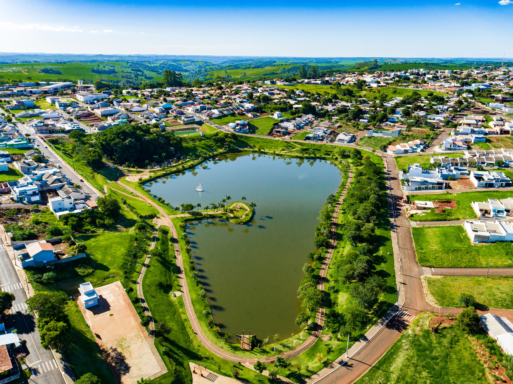
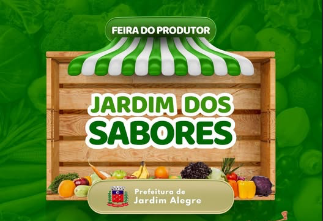
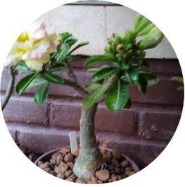
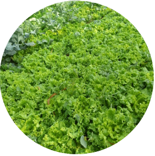
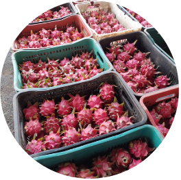
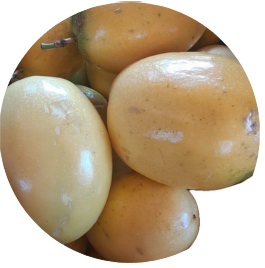

# Projeto Agrinho 2026 - Tutorial Completo (Passo a passo, sem cortes)

---

## 1) Estrutura de pastas e arquivos

Organize a pasta do projeto assim:

```
Projeto/
  assets/
    (todas as imagens)
  index.html
  style.css
  script-video.js
  script-noticias.js
  script-quiz.js
```

Dica importante:
- Se voce mudar o nome de uma imagem, altere o caminho correspondente no HTML.

---

## 2) HTML completo (estrutura do site)

Crie o arquivo `index.html` com o conteudo abaixo (copie exatamente):

```html
<!-- index.html -->
<!DOCTYPE html>
<html lang="pt-BR">
<head>
  <meta charset="UTF-8" />
  <meta name="viewport" content="width=device-width, initial-scale=1.0" />
  <title>Agrinho 2026</title>

  <!-- Fontes semelhantes ao visual do layout -->
  <link rel="preconnect" href="https://fonts.googleapis.com" />
  <link rel="preconnect" href="https://fonts.gstatic.com" crossorigin />
  <link href="https://fonts.googleapis.com/css2?family=Cinzel:wght@400;600;700&family=Playfair+Display:wght@400;600&display=swap" rel="stylesheet" />

  <link rel="stylesheet" href="style.css" />
</head>
<body>
  <!-- SEÇÃO 1: topo com título e imagem circular -->
  <header class="topo">
    <div class="conteiner topo-grade">
      <div class="topo-esquerda">
        <h1>AGRINHO<br>2026</h1>
        <p class="frase">
          "Agro forte, futuro sustentável: equilíbrio entre produção e meio ambiente."
        </p>
      </div>

      <div class="topo-direita">
        <!-- Troque pela sua imagem do concurso -->
        
      </div>
    </div>
  </header>

  <!-- SEÇÃO 2: banner com foto grande e texto -->
  <section class="banner-parana">
    <div class="sobreposicao">
      <div class="conteiner banner-conteudo">
        <h2>PARANÁ</h2>
        <p>
          O agronegócio do Paraná é um dos pilares da economia brasileira, destacando-se pela alta
          produtividade e pelo equilíbrio entre produção e preservação ambiental.
        </p>
      </div>
    </div>
  </section>

  <!-- SEÇÃO 3: frase em faixa -->
  <section class="faixa-texto">
    <div class="conteiner">
      <p>
        O Paraná é frequentemente citado como uma referência global em sustentabilidade no agronegócio, equilibrando alta produtividade com a preservação de recursos naturais. Em 2026, o estado mantém o título (conquistado por anos consecutivos) de estado mais sustentável do Brasil segundo rankings de competitividade e práticas ESG.
      </p>
    </div>
  </section>

  <!-- SEÇÃO 4: três cartoes com imagens -->
  <section class="cartoes">
    <article class="cartao cartao-1">
      <div class="bolha gatilho-video" data-id-video="graos" data-url-video="https://www.youtube.com/embed/NdcTTXxXsOU?si=uc9wIzrJ57qQvcl_?autoplay=1">Paraná amplia participação na produção nacional de grãos</div>
    </article>
    <article class="cartao cartao-2">
      <div class="bolha gatilho-video" data-id-video="sustentavel" data-url-video="https://www.youtube.com/embed/W60i5AXB_xk?si=86JGva4tLfVAZhiq?autoplay=1">Paraná é eleito o estado mais sustentável do Brasil pela 4ª vez consecutiva</div>
    </article>
    <article class="cartao cartao-3">
      <div class="bolha gatilho-video" data-id-video="sanepar" data-url-video="https://www.youtube.com/watch?v=q3OQW8svbgk">Paraná Avança: 100% Água Tratada e Esgoto Coletado com a Sanepar</div>
    </article>
  </section>

  

  <!-- SEÇÃO 5: bloco "ENQUANTO ISSO" + caixa de notícias -->
  <section class="noticias">
    <div class="noticias-esquerda">
      
      <h3>ENQUANTO<br>ISSO</h3>
    </div>

    <aside class="noticias-direita">
      <h4>
        <button
          class="gatilho-noticia"
          type="button"
          data-id-noticia="inauguracao"
          data-titulo-noticia="Inauguração histórica em Jardim Alegre"
          data-imagem-noticia="./assets/inauguracao.jpg"
          data-url-noticia="https://www.jardimalegre.pr.gov.br/noticia?noticia=5655"
        >
          Inauguração histórica em Jardim Alegre
        </button>
      </h4>
      <p>Cooperativa inicia ações com hortas orgânicas em áreas de reforma agrária no Paraná.</p>

      <h4>
          <button
          class="gatilho-noticia"
          type="button"
          data-id-noticia="ambiental"
          data-titulo-noticia="Educação Ambiental"
          data-imagem-noticia="./assets/meio-ambiente.jpg"
          data-url-noticia="https://www.jardimalegre.pr.gov.br/noticia?noticia=6132"
        >
          Educação Ambiental
        </button>
        
    </h4>
      <p>Atividades de reciclagem para crianças e comunidade local.</p>

      <h4>
          <button
          class="gatilho-noticia"
          type="button"
          data-id-noticia="conselho"
          data-titulo-noticia="Conselho Municipal"
          data-imagem-noticia="./assets/conselho.jpg"
          data-url-noticia="https://www.jardimalegre.pr.gov.br/noticia?noticia=6112"
        >
           Conselho Municipal
        </button>
       
    </h4>
      <p>Conselho municipal discute ações para fortalecer o meio rural e o pequeno produtor.</p>
    </aside>
  </section>

  <!-- SEÇÃO 6: feira + galeria circular -->
  <section class="feira">
    <div class="feira-esquerda">
      
      <p>Quando: todas as quartas-feiras. Local: Avenida Paraná, perto do monumento.</p>
    </div>

    <div class="feira-direita">
      
      
      
      
    </div>
  </section>

  <section class="chamada-quiz">
    <div class="conteiner chamada-quiz-conteiner">
      <h3>Pronto para testar seu conhecimento?</h3>
      <button class="botao-abrir-quiz" id="botao-abrir-quiz" type="button">
        Abrir mini quiz
      </button>
    </div>
  </section>
  <div class="modal-video" id="modal-video" aria-hidden="true">
    <div class="modal-video-conteudo" role="dialog" aria-modal="true" aria-label="Vídeo">
      <button class="modal-video-fechar" id="fechar-modal-video" type="button" aria-label="Fechar vídeo">×</button>
      <iframe
        id="frame-video"
        src=""
        title="Vídeo do Paraná"
        allow="accelerometer; autoplay; clipboard-write; encrypted-media; gyroscope; picture-in-picture"
        allowfullscreen
      ></iframe>
      <div class="transcricao-video">
        <h4>Transcrição do vídeo</h4>
        <p id="texto-transcricao-video">Selecione um vídeo para ver a transcrição.</p>
      </div>
    </div>
  </div>

  <div class="modal-noticia" id="modal-noticia" aria-hidden="true">
    <div class="modal-noticia-conteudo" role="dialog" aria-modal="true" aria-label="Notícia">
      <button class="modal-noticia-fechar" id="fechar-modal-noticia" type="button" aria-label="Fechar notícia">×</button>
      
      <h4 id="titulo-modal-noticia"></h4>
      <div class="acoes-noticia">
        <button class="botao-ler-noticia" id="botao-ler-noticia" type="button">Ler notícia</button>
        <button class="botao-link-noticia" id="botao-link-noticia" type="button">Ir para notícia</button>
      </div>
    </div>
  </div>

  <div class="modal-quiz" id="modal-quiz" aria-hidden="true">
    <div class="modal-quiz-conteudo" role="dialog" aria-modal="true" aria-label="Mini quiz">
      <button class="modal-quiz-fechar" id="fechar-modal-quiz" type="button" aria-label="Fechar quiz">×</button>

      <div class="quiz" id="mini-quiz">
        <div class="quiz-conteiner">
          <div class="quiz-introducao">
            <h2>Mini Quiz do Agrinho</h2>
            <p>
              Teste seus conhecimentos sobre o agronegócio sustentável do Paraná. São 5 perguntas rápidas.
            </p>
          </div>

          <form class="formulario-quiz" id="formulario-quiz">
            <div class="progresso-quiz">
              <span id="passo-quiz">1</span>/<span id="total-quiz">5</span>
            </div>

            <div class="etapas-quiz">
              <div class="etapa-quiz ativo" data-step="1">
                <h3 class="titulo-pergunta-quiz">1) Qual é o principal destaque do agronegócio do Paraná citado no projeto?</h3>
                <div class="opcoes-quiz">
                  <label class="opcao-quiz">
                    <input type="radio" name="q1" value="a" /> Alta produtividade com preservação ambiental
                  </label>
                  <label class="opcao-quiz" data-correta="true">
                    <input type="radio" name="q1" value="b" /> Equilíbrio entre produção e preservação ambiental
                  </label>
                  <label class="opcao-quiz">
                    <input type="radio" name="q1" value="c" /> Foco exclusivo em exportação de grãos
                  </label>
                </div>
                <button class="botao-proximo-quiz" type="button" disabled>Próximo</button>
              </div>

              <div class="etapa-quiz" data-step="2">
                <h3 class="titulo-pergunta-quiz">2) Segundo o conteúdo, o Paraná é referência global em:</h3>
                <div class="opcoes-quiz">
                  <label class="opcao-quiz" data-correta="true">
                    <input type="radio" name="q2" value="a" /> Sustentabilidade no agronegócio
                  </label>
                  <label class="opcao-quiz">
                    <input type="radio" name="q2" value="b" /> Pesca industrial
                  </label>
                  <label class="opcao-quiz">
                    <input type="radio" name="q2" value="c" /> Mineração de ferro
                  </label>
                </div>
                <button class="botao-proximo-quiz" type="button" disabled>Próximo</button>
              </div>

              <div class="etapa-quiz" data-step="3">
                <h3 class="titulo-pergunta-quiz">3) O evento da feira do produtor acontece:</h3>
                <div class="opcoes-quiz">
                  <label class="opcao-quiz" data-correta="true">
                    <input type="radio" name="q3" value="a" /> Todas as quartas-feiras
                  </label>
                  <label class="opcao-quiz">
                    <input type="radio" name="q3" value="b" /> Apenas aos domingos
                  </label>
                  <label class="opcao-quiz">
                    <input type="radio" name="q3" value="c" /> Somente uma vez por mês
                  </label>
                </div>
                <button class="botao-proximo-quiz" type="button" disabled>Próximo</button>
              </div>

              <div class="etapa-quiz" data-step="4">
                <h3 class="titulo-pergunta-quiz">4) Qual tema aparece na seção de notícias?</h3>
                <div class="opcoes-quiz">
                  <label class="opcao-quiz">
                    <input type="radio" name="q4" value="a" /> Lançamento de satélites
                  </label>
                  <label class="opcao-quiz" data-correta="true">
                    <input type="radio" name="q4" value="b" /> Educação ambiental
                  </label>
                  <label class="opcao-quiz">
                    <input type="radio" name="q4" value="c" /> Turismo de luxo
                  </label>
                </div>
                <button class="botao-proximo-quiz" type="button" disabled>Próximo</button>
              </div>

              <div class="etapa-quiz" data-step="5">
                <h3 class="titulo-pergunta-quiz">5) O Paraná foi eleito o estado mais sustentável do Brasil pela:</h3>
                <div class="opcoes-quiz">
                  <label class="opcao-quiz">
                    <input type="radio" name="q5" value="a" /> 1ª vez consecutiva
                  </label>
                  <label class="opcao-quiz" data-correta="true">
                    <input type="radio" name="q5" value="b" /> 4ª vez consecutiva
                  </label>
                  <label class="opcao-quiz">
                    <input type="radio" name="q5" value="c" /> 10ª vez consecutiva
                  </label>
                </div>
                <button class="botao-proximo-quiz" type="button" disabled>Finalizar</button>
              </div>
            </div>

            <div class="resultado-quiz" id="resultado-quiz" aria-live="polite"></div>
            <div class="acoes-quiz oculto" id="acoes-quiz">
              <button class="botao-reiniciar-quiz" type="button" id="botao-reiniciar-quiz">Reiniciar</button>
            </div>
          </form>
        </div>
      </div>
    </div>
  </div>

  <script src="script-video.js"></script>
  <script src="script-noticias.js"></script>
  <script src="script-quiz.js"></script>
</body>
</html>
```

O que este HTML faz:
- Monta todas as secoes do site (topo, banner, faixa, cartoes, noticias, feira).
- Define os modais (video, noticia e quiz) no final da pagina.
- Carrega os arquivos JavaScript no final.

---

## 3) CSS completo (visual e responsivo)

Crie o arquivo `style.css` com o conteudo abaixo:

```css
/* style.css */

/* Variáveis de cor para facilitar ajustes do tema */
:root {
  --verde-oliva: #7f8d3d;
  --verde-escuro: #4f5f2b;
  --vinho: #5a022f;
  --bege: #c5a86f;
  --azul-caixa: #7f9198;
  --branco: #ffffff;
}

/* Reset básico para consistência entre navegadores */
* {
  margin: 0;
  padding: 0;
  box-sizing: border-box;
}

/* Configuração global do corpo */
body {
  font-family: "Playfair Display", serif;
  background: #f4f1e8;
  color: var(--branco);
  line-height: 1.5;
}

/* Container central para limitar largura de conteúdo */
.conteiner {
  width: min(1150px, 92%);
  margin: 0 auto;
}

/* HERO */
.topo {
  background: var(--verde-oliva);
  padding: 52px 0;
}

.topo-grade {
  display: grid;
  grid-template-columns: 1fr 1fr;
  align-items: center;
  gap: 40px;
}

.topo-esquerda h1 {
  font-family: "Cinzel", serif;
  color: var(--vinho);
  font-size: clamp(2.2rem, 7vw, 5.2rem);
  line-height: 1.02;
  margin-bottom: 26px;
}

.frase {
  max-width: 320px;
  color: var(--vinho);
  border: 1px solid var(--vinho);
  border-radius: 999px;
  padding: 18px 20px;
  text-align: center;
  font-size: 1.1rem;
}

.topo-direita img {
  width: min(520px, 100%);
  aspect-ratio: 1 / 1;
  object-fit: cover;
  border-radius: 50%;
  display: block;
  margin-inline: auto;
}

/* BANNER PARANÁ */
.banner-parana {
  min-height: 58vh;
  background: url("./assets/Fundo-1.png") center / cover no-repeat;
}

.sobreposicao {
  background: linear-gradient(to right, rgba(0,0,0,.35), rgba(0,0,0,.2));
  min-height: inherit;
}

.banner-conteudo {
  min-height: 58vh;
  display: flex;
  justify-content: space-between;
  align-items: center;
  gap: 24px;
}

.banner-conteudo h2 {
  font-family: "Cinzel", serif;
  font-size: clamp(2rem, 5vw, 4rem);
  font-weight: 400;
}

.banner-conteudo p {
  max-width: 520px;
  font-size: clamp(1rem, 2vw, 1.8rem);
}

/* FAIXA */
.faixa-texto {
  background: var(--verde-oliva);
  text-align: center;
  padding: 28px 0;
}

.faixa-texto p {
  font-family: "Cinzel", serif;
  font-size: clamp(1rem, 2vw, 1.8rem);
}

/* CARDS */
.cartoes {
  display: grid;
  grid-template-columns: repeat(3, 1fr);
}

.cartao {
  min-height: 340px;
  display: grid;
  place-items: center;
  background-size: cover;
  background-position: center;
}

.cartao-1 { background-image: url("./assets/fundo-2.jpeg"); }
.cartao-2 { background-image: url("./assets/fundo-3.png"); }
.cartao-3 { background-image: url("./assets/fundo-4.png"); }

.bolha {
  width: min(230px, 90%);
  padding: 18px;
  border: 1px solid #fff;
  border-radius: 999px;
  text-align: center;
  background: rgba(0, 0, 0, 0.35);
  font-size: 1.15rem;
}

/* NOTÍCIAS */
.noticias {
  display: grid;
  grid-template-columns: 1.1fr 1fr;
  background: var(--verde-escuro);
}

.noticias-esquerda {
  position: relative;
}

.noticias-esquerda img {
  width: 100%;
  height: 100%;
  object-fit: cover;
  min-height: 480px;
}

.noticias-esquerda h3 {
  position: absolute;
  left: 8%;
  bottom: 7%;
  font-family: "Cinzel", serif;
  font-size: clamp(2rem, 7vw, 5rem);
  font-weight: 700;
  line-height: 0.95;
}

.noticias-direita {
  margin: 52px;
  background: var(--azul-caixa);
  padding: 32px;
}

.noticias-direita h4 {
  font-family: "Cinzel", serif;
  font-size: clamp(1.2rem, 2.5vw, 2rem);
  margin: 0 0 8px;
  text-decoration: underline;
}

.gatilho-noticia {
  border: 0;
  background: transparent;
  color: inherit;
  font: inherit;
  text-align: left;
  text-decoration: underline;
  cursor: pointer;
}

.gatilho-noticia:hover {
  opacity: 0.82;
}

.noticias-direita p {
  margin: 0 0 24px;
  font-size: 1.1rem;
}

/* FEIRA */
.feira {
  display: grid;
  grid-template-columns: 1.15fr 1fr;
  background: var(--bege);
}

.feira-esquerda img {
  width: 100%;
  height: 460px;
  object-fit: cover;
  display: block;
}

.feira-esquerda p {
  color: #fff;
  text-align: center;
  padding: 16px;
  font-size: 1.15rem;
}

.feira-direita {
  padding: 34px;
  display: grid;
  grid-template-columns: repeat(2, minmax(120px, 1fr));
  gap: 28px;
  align-content: center;
  justify-items: center;
}

.feira-direita img {
  width: min(230px, 100%);
  aspect-ratio: 1 / 1;
  border-radius: 50%;
  object-fit: cover;
}

/* RESPONSIVIDADE: tablets */
@media (max-width: 980px) {
  .topo-grade,
  .banner-conteudo,
  .noticias,
  .feira {
    grid-template-columns: 1fr;
  }

  .banner-conteudo {
    padding: 42px 0;
    align-items: flex-start;
    min-height: auto;
  }

  .cartoes {
    grid-template-columns: 1fr 1fr;
  }

  .noticias-direita {
    margin: 0;
  }

  .quiz-conteiner {
    grid-template-columns: 1fr;
  }

  .chamada-quiz-conteiner {
    justify-content: center;
    text-align: center;
  }
}

/* RESPONSIVIDADE: celulares */
@media (max-width: 640px) {
  .topo {
    padding: 28px 0;
  }

  .frase {
    max-width: 100%;
    font-size: 1rem;
  }

  .cartoes {
    grid-template-columns: 1fr;
  }

  .cartao {
    min-height: 290px;
  }

  .feira-direita {
    grid-template-columns: 1fr 1fr;
    gap: 18px;
    padding: 20px;
  }

  .noticias-direita {
    padding: 22px;
  }

  .transcricao-video {
    display: none;
  }

  .formulario-quiz {
    padding: 18px;
  }

  .modal-quiz-conteudo {
    padding: 16px;
  }

  .opcoes-quiz {
    grid-template-columns: 1fr;
  }

  .opcao-quiz {
    aspect-ratio: auto;
  }
}

/* POPUP DE VIDEO */
.bolha.gatilho-video {
  cursor: pointer;
  transition: transform 0.2s ease, background 0.2s ease;
}

.bolha.gatilho-video:hover {
  transform: scale(1.04);
  background: rgba(0, 0, 0, 0.52);
}

.modal-video {
  position: fixed;
  inset: 0;
  display: none;
  place-items: center;
  background: rgba(0, 0, 0, 0.75);
  padding: 20px;
  z-index: 999;
}

.modal-video.ativo {
  display: grid;
}

.modal-video-conteudo {
  position: relative;
  width: min(920px, 94vw);
  background: #000;
  border-radius: 12px;
  overflow: hidden;
  max-height: 90vh;
  display: flex;
  flex-direction: column;
}

.modal-video-conteudo iframe {
  width: 100%;
  aspect-ratio: 16 / 9;
  border: 0;
  display: block;
}

.transcricao-video {
  padding: 16px;
  background: #f4f1e8;
  color: #222;
  overflow-y: auto;
  max-height: 32vh;
}

.transcricao-video h4 {
  font-family: "Cinzel", serif;
  font-size: 1.2rem;
  margin: 0 0 8px;
}

.transcricao-video p {
  margin: 0;
  line-height: 1.55;
}

.modal-video-fechar {
  position: absolute;
  top: 8px;
  right: 8px;
  width: 38px;
  height: 38px;
  border: 0;
  border-radius: 50%;
  background: rgba(255, 255, 255, 0.9);
  color: #222;
  font-size: 1.6rem;
  line-height: 1;
  cursor: pointer;
}

body.modal-aberto {
  overflow: hidden;
}

/* POPUP DE NOTICIA */
.modal-noticia {
  position: fixed;
  inset: 0;
  display: none;
  place-items: center;
  background: rgba(0, 0, 0, 0.75);
  padding: 20px;
  z-index: 1000;
}

.modal-noticia.ativo {
  display: grid;
}

.modal-noticia-conteudo {
  position: relative;
  width: min(760px, 94vw);
  background: #f4f1e8;
  color: #2c2c2c;
  border-radius: 12px;
  padding: 18px 18px 22px;
}

.modal-noticia-conteudo img {
  width: 100%;
  height: auto;
  max-height: 52vh;
  object-fit: contain;
  border-radius: 10px;
  margin-bottom: 12px;
  background: #ddd;
  display: block;
}

.modal-noticia-conteudo h4 {
  font-family: "Cinzel", serif;
  color: #2c2c2c;
  font-size: clamp(1.1rem, 2.4vw, 1.7rem);
  margin: 0 0 14px;
}

.botao-ler-noticia {
  border: 0;
  border-radius: 999px;
  padding: 12px 20px;
  background: var(--verde-escuro);
  color: #fff;
  font-size: 1rem;
  cursor: pointer;
}

.acoes-noticia {
  display: flex;
  gap: 10px;
  flex-wrap: wrap;
}

.botao-link-noticia {
  border: 0;
  border-radius: 999px;
  padding: 12px 20px;
  background: var(--vinho);
  color: #fff;
  font-size: 1rem;
  cursor: pointer;
}

.modal-noticia-fechar {
  position: absolute;
  top: 8px;
  right: 8px;
  width: 38px;
  height: 38px;
  border: 0;
  border-radius: 50%;
  background: rgba(0, 0, 0, 0.8);
  color: #fff;
  font-size: 1.5rem;
  line-height: 1;
  cursor: pointer;
}

/* QUIZ */
.quiz {
  background: transparent;
  color: #2c2c2c;
  padding: 0;
}

.quiz-conteiner {
  display: grid;
  grid-template-columns: 1fr;
  gap: 20px;
  align-items: start;
}

.quiz-introducao h2 {
  font-family: "Cinzel", serif;
  font-size: clamp(1.6rem, 3.4vw, 2.8rem);
  color: var(--vinho);
  margin-bottom: 12px;
}

.quiz-introducao p {
  font-size: 1.05rem;
  max-width: 360px;
}

.formulario-quiz {
  background: #ffffff;
  border: 1px solid rgba(0, 0, 0, 0.08);
  border-radius: 16px;
  padding: 22px 22px 26px;
  box-shadow: 0 12px 30px rgba(0, 0, 0, 0.08);
  background-image: radial-gradient(circle at top, rgba(127, 141, 61, 0.1), transparent 60%);
}

.progresso-quiz {
  font-family: "Cinzel", serif;
  color: var(--vinho);
  font-size: 1.1rem;
  text-align: right;
}

.etapas-quiz {
  margin-top: 12px;
}

.etapa-quiz {
  display: none;
  gap: 14px;
}

.etapa-quiz.ativo {
  display: grid;
}

.titulo-pergunta-quiz {
  font-family: "Cinzel", serif;
  font-size: clamp(1.25rem, 2.6vw, 1.7rem);
  color: #1f1f1f;
}

.opcoes-quiz {
  display: grid;
  grid-template-columns: repeat(auto-fit, minmax(160px, 1fr));
  gap: 12px;
}

.opcao-quiz {
  display: grid;
  place-items: center;
  text-align: center;
  padding: 16px;
  border-radius: 14px;
  border: 1px solid rgba(0, 0, 0, 0.12);
  background: #f7f3e6;
  cursor: pointer;
  transition: background 0.2s ease, border-color 0.2s ease, transform 0.2s ease;
  aspect-ratio: 1 / 1;
  font-size: 1.08rem;
}

.opcao-quiz input {
  position: absolute;
  opacity: 0;
  pointer-events: none;
}

.opcao-quiz:hover {
  background: rgba(127, 141, 61, 0.12);
  transform: translateY(-2px);
}

.opcao-quiz.selecionado {
  border-color: var(--verde-escuro);
  background: rgba(127, 141, 61, 0.25);
}

.botao-proximo-quiz {
  justify-self: end;
  border: 0;
  border-radius: 999px;
  padding: 12px 24px;
  font-size: 1.05rem;
  cursor: pointer;
  background: var(--verde-escuro);
  color: #fff;
}

.botao-proximo-quiz:disabled {
  opacity: 0.6;
  cursor: not-allowed;
}

.acoes-quiz {
  display: flex;
  gap: 10px;
  margin-top: 12px;
}

.acoes-quiz.oculto {
  display: none;
}

.botao-reiniciar-quiz {
  border: 0;
  border-radius: 999px;
  padding: 12px 20px;
  font-size: 1.05rem;
  cursor: pointer;
  background: var(--vinho);
  color: #fff;
}

.resultado-quiz {
  margin-top: 16px;
  font-size: 1.15rem;
  color: #1f1f1f;
}

.formulario-quiz.finalizado .etapas-quiz {
  display: none;
}

.formulario-quiz.finalizado .progresso-quiz {
  opacity: 0.7;
}

/* CTA QUIZ */
.chamada-quiz {
  background: var(--verde-oliva);
  padding: 34px 0 44px;
}

.chamada-quiz-conteiner {
  display: flex;
  flex-wrap: wrap;
  align-items: center;
  justify-content: space-between;
  gap: 18px;
  color: var(--vinho);
}

.chamada-quiz-conteiner h3 {
  font-family: "Cinzel", serif;
  font-size: clamp(1.4rem, 3vw, 2.4rem);
}

.botao-abrir-quiz {
  border: 0;
  border-radius: 999px;
  padding: 14px 26px;
  font-size: 1.05rem;
  background: var(--vinho);
  color: #fff;
  cursor: pointer;
  box-shadow: 0 0 0 0 rgba(90, 2, 47, 0.45);
  animation: pulsoQuiz 1.6s ease-in-out infinite;
}

@keyframes pulsoQuiz {
  0% { transform: scale(1); box-shadow: 0 0 0 0 rgba(90, 2, 47, 0.45); }
  50% { transform: scale(1.05); box-shadow: 0 0 0 16px rgba(90, 2, 47, 0); }
  100% { transform: scale(1); box-shadow: 0 0 0 0 rgba(90, 2, 47, 0); }
}

/* MODAL QUIZ */
.modal-quiz {
  position: fixed;
  inset: 0;
  display: none;
  place-items: center;
  background: rgba(0, 0, 0, 0.75);
  padding: 20px;
  z-index: 1001;
}

.modal-quiz.ativo {
  display: grid;
}

.modal-quiz-conteudo {
  position: relative;
  width: min(980px, 96vw);
  background: #f4f1e8;
  color: #2c2c2c;
  border-radius: 16px;
  padding: 22px;
  max-height: 90vh;
  overflow-y: auto;
}

.modal-quiz-fechar {
  position: absolute;
  top: 10px;
  right: 10px;
  width: 38px;
  height: 38px;
  border: 0;
  border-radius: 50%;
  background: rgba(0, 0, 0, 0.8);
  color: #fff;
  font-size: 1.5rem;
  line-height: 1;
  cursor: pointer;
}

/* Acessibilidade: foco visível para navegação por teclado */
```

O que este CSS faz:
- Define cores, fontes e layout em grade.
- Deixa o site responsivo (celular e tablet).
- Controla o visual dos modais e do mini quiz.

---

## 4) JavaScript do video (modal)

Crie o arquivo `script-video.js` com o conteudo abaixo:

```js
const modalVideo = document.getElementById('modal-video');
const frameVideo = document.getElementById('frame-video');
const textoTranscricaoVideo = document.getElementById('texto-transcricao-video');
const botaoFecharVideo = document.getElementById('fechar-modal-video');
const gatilhosVideo = document.querySelectorAll('.gatilho-video');

// EDITE AQUI: transcricoes de cada video do modal.
const TRANSCRICOES_VIDEO = {
  graos: `
Olá, você que nos acompanha. O Paraná deve atingir uma participação maior nesse ano em relação ao restante do país no que se refere à safra paranaense.

O Paraná deve produzir 13,9% de toda a safra de grãos do Brasil. De acordo com o levantamento sistemático da produção agrícola do Instituto Brasileiro de Geografia Estatística, houve um leve crescimento em relação a dezembro, quando a estimativa era de que o Paraná produziria cerca de 13,5% da safra nacional.

O estado historicamente é o segundo maior produtor do Brasil, atrás apenas do Mato Grosso, que reúne 30,3% de participação. Rio Grande do Sul, Goiás e Mato Grosso do Sul são os outros principais produtores do país.

Um dos fatores é a perspectiva de aumento na produção de soja no Paraná, com produção estimada em 22,2 milhões de toneladas. O estado deve ter o segundo maior volume colhido no país, um crescimento significativo em relação às previsões iniciais.

A estimativa de produção nacional da oleaginosa alcançou um novo recorde na série histórica, totalizando 172,5 milhões de toneladas.

Em relação ao milho segunda safra, produto em que o Paraná é o segundo maior produtor do país, o estado tem uma estimativa de produção de 17,4 milhões de toneladas, participando com 16% da safra nacional.

A estimativa nacional da produção de milho, segunda safra, foi de 105 milhões de toneladas, um crescimento de 0,6% em relação ao terceiro prognóstico do ano passado.

O Paraná também é destaque na produção de feijão, sendo o maior produtor do país, com previsão de 736.500 toneladas, representando 24,2% da participação nacional.

Como se vê, o Paraná deve ter um desempenho relevante na atual safra, sem contar também a produção de proteínas, em que o estado é um dos destaques nacionais.

Obrigado, amigos. Voltamos no próximo programa.
`,
  sustentavel: `
Pelo quarto ano consecutivo, o Paraná é considerado o estado mais sustentável do Brasil, com nota máxima no ranking de competitividade dos estados divulgado pelo Centro de Liderança Pública.

Além de liderar o eixo ligado ao meio ambiente, o estado também apresenta o maior crescimento do país no índice de potencial de mercado.

Quem mora ou visita o estado se encanta e imediatamente associa o Paraná a uma palavra: sustentabilidade. Políticas públicas ligadas ao combate ao desmatamento, à coleta seletiva de lixo, associadas à transparência dada pelo governo a essas ações e aos altos índices de tratamento de esgoto, fazem do estado o mais sustentável do país pelo quarto ano consecutivo.

O secretário de Estado do Desenvolvimento Sustentável, Everton Souza, atribui esse desempenho a uma combinação de fatores e aos esforços do poder público. Segundo ele, trata-se de uma gestão de política ambiental dentro do estado que busca criar um ambiente de negócios, atrair empreendimentos e investimentos, gerar emprego, renda, impostos e qualidade de vida para os paranaenses, ao mesmo tempo mantendo importantes preocupações com o meio ambiente.

A nota 100 do Paraná nesse quesito ficou acima da obtida por São Paulo e Goiás. O estado também avançou em outras categorias: subiu 13 posições no potencial de mercado, duas posições em infraestrutura e uma em solidez fiscal.

O desempenho em sustentabilidade ambiental, somado à melhora em outros segmentos analisados pelo estudo, fez com que o Paraná continuasse na terceira colocação na classificação geral, aproximando-se de São Paulo e Santa Catarina, que aparecem na primeira e segunda posições, respectivamente.

Divulgado anualmente, o ranking leva em consideração 99 indicadores agrupados em 10 eixos estratégicos, nas áreas de infraestrutura, sustentabilidade social e ambiental, inovação, capital humano, segurança, educação e eficiência da máquina pública.

O estudo é realizado pelo Centro de Liderança Pública em parceria com a consultoria Tendências e a startup Seall.

O Paraná também se destacou em itens como eficiência da máquina pública, ficando em segundo lugar, entre Rio Grande do Sul e Santa Catarina.

As informações completas do ranking de competitividade de 2024 foram divulgadas durante o 13º Congresso Consad de Gestão Pública, evento que reúne governadores, secretários estaduais e gestores públicos em Brasília.

O governador Carlos Massa Ratinho Júnior, que participou do congresso, comemorou os resultados. Segundo ele, é a quarta vez consecutiva que o Paraná aparece como o estado mais sustentável do país, demonstrando o cuidado com o meio ambiente sem esquecer do desenvolvimento econômico.

Ele destacou que o estado conseguiu criar um equilíbrio entre preservação ambiental e crescimento econômico, além de colocar o Paraná entre os três estados mais competitivos do Brasil.

Segundo o governador, quando a máquina pública funciona e o setor produtivo também, o resultado é um estado que cresce cada vez mais.
  `,
  sanepar: `
Pelo segundo ano seguido, o Paraná foi considerado o estado mais inovador e sustentável do Brasil, segundo o ranking da consultoria Bright Cities.

O ranking leva em conta indicadores utilizados pela Organização das Nações Unidas (ONU) para orientar melhores práticas de desenvolvimento sustentável e inclusivo.

Entre os destaques do estado, as cidades de Curitiba, Maringá e Londrina aparecem entre as melhores cidades do país no levantamento.
  `,
};

function montarUrlEmbed(urlBruta) {
  try {
    const url = new URL(urlBruta);
    let idVideo = '';

    if (url.hostname.includes('youtu.be')) {
      idVideo = url.pathname.slice(1);
    } else if (url.hostname.includes('youtube.com')) {
      if (url.pathname.includes('/embed/')) {
        idVideo = url.pathname.split('/embed/')[1];
      } else {
        idVideo = url.searchParams.get('v') || '';
      }
    }

    idVideo = idVideo.split('?')[0].split('&')[0];
    if (!idVideo) return urlBruta;
    return `https://www.youtube.com/embed/${idVideo}?autoplay=1&mute=0&playsinline=1&rel=0&cc_load_policy=1&hl=pt-BR`;
  } catch {
    return urlBruta;
  }
}

function abrirModalVideo(gatilho) {
  const urlVideo = gatilho.dataset.urlVideo;
  const idVideo = gatilho.dataset.idVideo;
  if (!urlVideo) return;

  textoTranscricaoVideo.textContent = TRANSCRICOES_VIDEO[idVideo] || 'Transcricao ainda nao cadastrada para este video.';
  frameVideo.src = montarUrlEmbed(urlVideo);
  modalVideo.classList.add('ativo');
  document.body.classList.add('modal-aberto');
}

function fecharModalVideo() {
  frameVideo.src = '';
  modalVideo.classList.remove('ativo');
  document.body.classList.remove('modal-aberto');
}

gatilhosVideo.forEach((gatilho) => {
  gatilho.addEventListener('click', () => {
    abrirModalVideo(gatilho);
  });
});

botaoFecharVideo.addEventListener('click', fecharModalVideo);

modalVideo.addEventListener('click', (event) => {
  if (event.target === modalVideo) fecharModalVideo();
});

document.addEventListener('keydown', (event) => {
  if (event.key === 'Escape' && modalVideo.classList.contains('ativo')) {
    fecharModalVideo();
  }
});
```

O que este JS faz:
- Abre um modal com video ao clicar nos cartoes.
- Mostra a transcricao correspondente ao video.
- Fecha o modal ao clicar no botao ou apertar ESC.

---

## 5) Transcricoes dos videos

As transcricoes ficam no objeto `TRANSCRICOES_VIDEO` dentro do `script-video.js`.

Se quiser editar, basta trocar o texto dentro das crases.

Exemplo:
```js
const TRANSCRICOES_VIDEO = {
  graos: `Texto da transcricao do video de graos`,
  sustentavel: `Texto da transcricao do video de sustentabilidade`,
  sanepar: `Texto da transcricao do video da Sanepar`
};
```

---

## 6) JavaScript das noticias (modal + leitura por voz)

Crie o arquivo `script-noticias.js` com o conteudo abaixo:

```js
const modalNoticia = document.getElementById('modal-noticia');
const imagemModalNoticia = document.getElementById('imagem-modal-noticia');
const tituloModalNoticia = document.getElementById('titulo-modal-noticia');
const botaoFecharNoticia = document.getElementById('fechar-modal-noticia');
const botaoLerNoticia = document.getElementById('botao-ler-noticia');
const botaoLinkNoticia = document.getElementById('botao-link-noticia');
const gatilhosNoticia = document.querySelectorAll('.gatilho-noticia');

// EDITE AQUI: coloque o texto completo que deve ser lido para cada noticia.
const TEXTOS_NOTICIAS = {
  inauguracao: `Na tarde desta quinta-feira, 10 de julho de 2025, Jardim Alegre viveu um momento histórico:
  foi inaugurada a Unidade de Beneficiamento de Ovos Caipira e Orgânico da COCAVI – Cooperativa de 
  Comercialização Camponesa Vale do Ivaí. Com este marco, Jardim Alegre passa a abrigar a primeira 
  agroindústria de ovos orgânicos em áreas de Reforma Agrária do Estado do Paraná, um avanço pioneiro 
  que fortalece a agricultura familiar e eleva o protagonismo do nosso município no cenário estadual.
As benfeitorias realizadas na estrutura da Unidade de beneficiamento foram contempladas por meio do 
Programa de Apoio ao Cooperativismo da Agricultura Familiar do Paraná (Coopera Paraná) sendo uma ação 
 governamental com o objetivo de fortalecer as cooperativas da agricultura familiar do Paraná, por 
 meio de ações integradas entre setor público e privado, para que melhorem sua eficiência, promovendo 
 maiores condições para a sustentabilidade das organizações.
Neste primeiro momento, a agroindústria tem capacidade de beneficiar cerca de 3 mil ovos por dia,
utilizando processo manual com bandejas classificadoras por diâmetro e balança para aferição do peso médio.
Com atuação prevista para atender cooperados e cooperadas de 33 municípios da área do Consórcio 
Intermunicipal CID Centro, a produção de ovos caipiras de Jardim Alegre está prestes a ganhar o 
Brasil, levando junto o exemplo de organização, trabalho coletivo e pioneirismo de nossa gente.`,

  ambiental: `A Secretaria de Meio Ambiente realizou uma importante ação de educação ambiental com alunos 
  da rede municipal, promovendo aprendizado de forma leve, interativa e educativa.
Com a atividade "Colorindo e Aprendendo", as crianças participaram de momentos lúdicos voltados à 
conscientização sobre a reciclagem de materiais, entendendo de forma prática a importância da 
separação correta do lixo, do cuidado com o meio ambiente e da responsabilidade coletiva.
Durante a ação, os estudantes puderam colorir materiais educativos, identificar as cores da 
coleta seletiva e aprender como pequenas atitudes no dia a dia fazem grande diferença para o 
futuro do planeta.
A iniciativa reforça o compromisso da Secretaria com a formação de cidadãos mais conscientes, 
incentivando desde cedo hábitos sustentáveis e o respeito ao meio ambiente.`,

  conselho: `O Conselho Municipal de Desenvolvimento Rural Sustentável e Solidário realizou uma reunião 
ordinária em conjunto com a Secretaria de Agricultura e Abastecimento, com foco na discussão de ações 
e estratégias voltadas ao fortalecimento do meio rural.

Durante o encontro, foram debatidas iniciativas que buscam melhorar as condições de trabalho, ampliar o 
apoio aos produtores e promover o desenvolvimento sustentável no campo, sempre alinhadas às necessidades 
da agricultura local.

O diálogo permanente entre o Conselho e o poder público reforça o compromisso com a construção de 
políticas públicas eficientes, garantindo mais oportunidades, qualidade de vida e valorização para 
quem vive e produz no meio rural`,
};

let textoNoticiaAtivo = '';
let urlNoticiaAtiva = '';

function pararLeituraNoticia() {
  if ('speechSynthesis' in window) {
    window.speechSynthesis.cancel();
  }
  botaoLerNoticia.textContent = 'Ler notícia';
}

function abrirModalNoticia(gatilho) {
  const titulo = gatilho.dataset.tituloNoticia || 'Notícia';
  const imagem = gatilho.dataset.imagemNoticia || '';
  const idNoticia = gatilho.dataset.idNoticia || '';
  const urlNoticia = gatilho.dataset.urlNoticia || '';

  tituloModalNoticia.textContent = titulo;
  imagemModalNoticia.src = imagem;
  imagemModalNoticia.alt = titulo;
  textoNoticiaAtivo = TEXTOS_NOTICIAS[idNoticia] || '';
  urlNoticiaAtiva = urlNoticia;

  modalNoticia.classList.add('ativo');
  document.body.classList.add('modal-aberto');
}

function fecharModalNoticia() {
  pararLeituraNoticia();
  modalNoticia.classList.remove('ativo');
  document.body.classList.remove('modal-aberto');
  imagemModalNoticia.src = '';
  imagemModalNoticia.alt = '';
  tituloModalNoticia.textContent = '';
  urlNoticiaAtiva = '';
}

function lerNoticia() {
  if (!('speechSynthesis' in window)) {
    alert('Leitura por voz não suportada neste navegador.');
    return;
  }

  if (!textoNoticiaAtivo.trim()) {
    alert('Adicione o texto da notícia no arquivo script-noticias.js (objeto TEXTOS_NOTICIAS).');
    return;
  }

  pararLeituraNoticia();
  const leitura = new SpeechSynthesisUtterance(textoNoticiaAtivo);
  leitura.lang = 'pt-BR';
  leitura.rate = 1;
  leitura.pitch = 1;

  leitura.onstart = () => {
    botaoLerNoticia.textContent = 'Lendo...';
  };

  leitura.onend = () => {
    botaoLerNoticia.textContent = 'Ler notícia';
  };

  window.speechSynthesis.speak(leitura);
}

function abrirNoticiaCompleta() {
  if (!urlNoticiaAtiva.trim()) {
    alert('Adicione a URL da notícia no data-url-noticia do botão no index.html.');
    return;
  }

  window.open(urlNoticiaAtiva, '_blank', 'noopener');
}

gatilhosNoticia.forEach((gatilho) => {
  gatilho.addEventListener('click', () => abrirModalNoticia(gatilho));
});

botaoLerNoticia.addEventListener('click', lerNoticia);
botaoLinkNoticia.addEventListener('click', abrirNoticiaCompleta);
botaoFecharNoticia.addEventListener('click', fecharModalNoticia);

modalNoticia.addEventListener('click', (event) => {
  if (event.target === modalNoticia) fecharModalNoticia();
});

document.addEventListener('keydown', (event) => {
  if (event.key === 'Escape' && modalNoticia.classList.contains('ativo')) {
    fecharModalNoticia();
  }
});
```

O que este JS faz:
- Abre um modal com imagem e titulo da noticia.
- Lê o texto em voz alta (se o navegador permitir).
- Abre o link completo da noticia em nova aba.

---

## 7) JavaScript do mini quiz (modal)

Crie o arquivo `script-quiz.js` com o conteudo abaixo:

```js
const formularioQuiz = document.getElementById('formulario-quiz');
const etapas = Array.from(document.querySelectorAll('.etapa-quiz'));
const indicadorPasso = document.getElementById('passo-quiz');
const indicadorTotal = document.getElementById('total-quiz');
const caixaResultado = document.getElementById('resultado-quiz');
const caixaAcoes = document.getElementById('acoes-quiz');
const botaoReiniciar = document.getElementById('botao-reiniciar-quiz');

const modalQuiz = document.getElementById('modal-quiz');
const botaoAbrirQuiz = document.getElementById('botao-abrir-quiz');
const botaoFecharQuiz = document.getElementById('fechar-modal-quiz');

const MENSAGENS_RESULTADO = [
  'Que bom! Voce acertou tudo e mostrou dominio do tema.',
  'Excelente! Quase la. Reveja os pontos sobre sustentabilidade.',
  'Bom esforco. Vale revisar as secoes de noticias e feira.',
  'Vamos tentar de novo. Releia o conteudo e tente novamente.'
];

function atualizarIndicadorPasso(indiceEtapa) {
  if (!indicadorPasso || !indicadorTotal) return;
  indicadorPasso.textContent = String(indiceEtapa + 1);
  indicadorTotal.textContent = String(etapas.length);
}

function obterOpcaoSelecionada(etapa) {
  const input = etapa.querySelector('input:checked');
  if (!input) return null;
  return input.closest('.opcao-quiz');
}

function atualizarEstiloSelecao(etapa) {
  const opcoes = etapa.querySelectorAll('.opcao-quiz');
  opcoes.forEach((opcao) => opcao.classList.remove('selecionado'));
  const selecionada = obterOpcaoSelecionada(etapa);
  if (selecionada) selecionada.classList.add('selecionado');
}

function atualizarBotaoProximo(etapa) {
  const botaoProximo = etapa.querySelector('.botao-proximo-quiz');
  if (!botaoProximo) return;
  const temSelecionada = Boolean(obterOpcaoSelecionada(etapa));
  botaoProximo.disabled = !temSelecionada;
}

function definirEtapaAtiva(indiceEtapa) {
  etapas.forEach((etapa, index) => {
    etapa.classList.toggle('ativo', index === indiceEtapa);
  });
  atualizarIndicadorPasso(indiceEtapa);
  const etapaAtiva = etapas[indiceEtapa];
  if (etapaAtiva) {
    atualizarEstiloSelecao(etapaAtiva);
    atualizarBotaoProximo(etapaAtiva);
  }
}

function calcularPontuacao() {
  let corretas = 0;
  etapas.forEach((etapa) => {
    const selecionada = obterOpcaoSelecionada(etapa);
    if (selecionada && selecionada.dataset.correta === 'true') {
      corretas += 1;
    }
  });
  return corretas;
}

function mostrarResultado() {
  const total = etapas.length;
  const corretas = calcularPontuacao();
  let mensagem = MENSAGENS_RESULTADO[3];
  if (corretas === total) mensagem = MENSAGENS_RESULTADO[0];
  else if (corretas >= total - 1) mensagem = MENSAGENS_RESULTADO[1];
  else if (corretas >= Math.ceil(total / 2)) mensagem = MENSAGENS_RESULTADO[2];

  caixaResultado.textContent = `Voce acertou ${corretas} de ${total}. ${mensagem} Deseja reiniciar?`;
  caixaAcoes.classList.remove('oculto');
  formularioQuiz.classList.add('finalizado');
  indicadorPasso.textContent = String(total);
}

function reiniciarQuiz() {
  formularioQuiz.reset();
  etapas.forEach((etapa) => {
    const opcoes = etapa.querySelectorAll('.opcao-quiz');
    opcoes.forEach((opcao) => opcao.classList.remove('selecionado'));
    const botaoProximo = etapa.querySelector('.botao-proximo-quiz');
    if (botaoProximo) botaoProximo.disabled = true;
  });
  caixaResultado.textContent = '';
  caixaAcoes.classList.add('oculto');
  formularioQuiz.classList.remove('finalizado');
  definirEtapaAtiva(0);
}

if (formularioQuiz) {
  formularioQuiz.addEventListener('submit', (event) => {
    event.preventDefault();
  });
}

etapas.forEach((etapa, index) => {
  const inputs = etapa.querySelectorAll('input');
  inputs.forEach((input) => {
    input.addEventListener('change', () => {
      atualizarEstiloSelecao(etapa);
      atualizarBotaoProximo(etapa);
    });
  });

  const botaoProximo = etapa.querySelector('.botao-proximo-quiz');
  if (botaoProximo) {
    botaoProximo.addEventListener('click', () => {
      if (index === etapas.length - 1) {
        mostrarResultado();
      } else {
        definirEtapaAtiva(index + 1);
      }
    });
  }
});

if (botaoReiniciar) {
  botaoReiniciar.addEventListener('click', reiniciarQuiz);
}

function abrirModalQuiz() {
  if (!modalQuiz) return;
  modalQuiz.classList.add('ativo');
  document.body.classList.add('modal-aberto');
  definirEtapaAtiva(0);
}

function fecharModalQuiz() {
  if (!modalQuiz) return;
  modalQuiz.classList.remove('ativo');
  document.body.classList.remove('modal-aberto');
}

if (botaoAbrirQuiz) {
  botaoAbrirQuiz.addEventListener('click', abrirModalQuiz);
}

if (botaoFecharQuiz) {
  botaoFecharQuiz.addEventListener('click', fecharModalQuiz);
}

if (modalQuiz) {
  modalQuiz.addEventListener('click', (event) => {
    if (event.target === modalQuiz) fecharModalQuiz();
  });
}

document.addEventListener('keydown', (event) => {
  if (event.key === 'Escape' && modalQuiz && modalQuiz.classList.contains('ativo')) {
    fecharModalQuiz();
  }
});
```

O que este JS faz:
- Abre o quiz no modal ao clicar no botao do final da pagina.
- Mostra uma pergunta por vez, com botao "Proximo".
- Marca a opcao escolhida com cor.
- Exibe o resultado final e permite reiniciar.

---

## 8) Como testar o site

1. Abra o `index.html` no navegador.
2. Clique nos cartoes para abrir os videos.
3. Clique nas noticias para ver o modal e testar a leitura.
4. Clique no botao animado no final para abrir o quiz.
5. Responda todas as perguntas e veja o resultado.

---

## 9) Checklist final

- [ ] Todas as imagens existem na pasta `assets/`.
- [ ] O HTML esta completo e sem erros de digitacao.
- [ ] O CSS esta carregando corretamente.
- [ ] Os modais de video e noticia abrem e fecham.
- [ ] As transcricoes aparecem no modal de video.
- [ ] O texto das noticias e lido corretamente.
- [ ] O mini quiz abre, avanca e mostra o resultado.

---

## Referencias

- [Araucaria](https://www.curitiba.pr.leg.br/informacao/nossa-memoria/simbolos-de-curitiba)
- [Card Agrinho](https://www.parana.pr.gov.br/aen/Noticia/Agrinho-2022-lanca-concurso-de-programacao-para-estudantes-da-rede-estadual)
- [Milho](https://www.correiobraziliense.com.br/webstories/flipar/2024/05/6864327-xodo-nas-festas-juninas-veja-a-importancia-do-milho-na-culinaria-brasileira.html)
- [Sustentabilidade](https://sebrae.com.br/sites/PortalSebrae/ufs/ap/artigos/dicas-para-tornar-sua-empresa-mais-competitiva-e-sustentavel,00160edf67bef510VgnVCM1000004c00210aRCRD)
- [Redes de abastecimento](https://www.parana.pr.gov.br/aen/Noticia/Redes-de-abastecimento-de-agua-e-esgoto-do-Parana-estao-acima-da-media-nacional)
- [Jardim Alegre](https://jornal.paranacentro.com.br/noticia/47613/jardim-alegre-uma-historia-de-raizes-simples-e-espirito-acolhedor)
- [Feira do produtor](https://www.jardimalegre.pr.gov.br/noticia?noticia=5514)

Ferramenta de apoio:
- ChatGPT (OpenAI)
